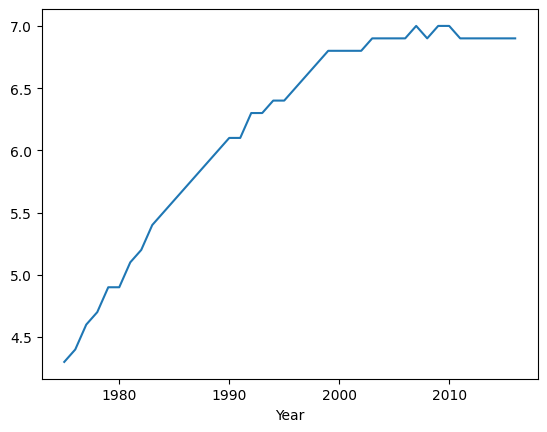
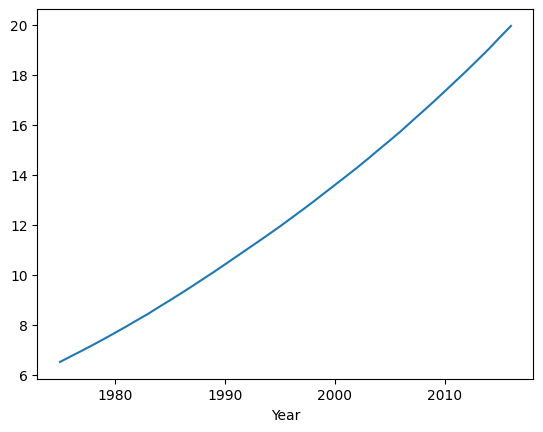

# Projeto final


```python
import pandas as pd
import numpy as np
```

### 1 - Limpe os dados do DataFrame, criando uma coluna de nome 'Obesity' que conterá os valores de obesidade. Transforme em float as colunas que porventura foram importadas como string.


```python
df_obesity['Obesity'] = df_obesity['Obesity (%)'].str.split().str[0] # Armazena o primeiro valor da String
df_obesity['Obesity'] = pd.to_numeric(df_obesity['Obesity'], errors='coerce') # Converte os valores de String para Float
df_obesity.loc[df_obesity['Obesity'] == 'No', 'Obesity'] = np.nan # Passa o índice e a coluna para alteração
df_obesity['Obesity'] = df_obesity['Obesity'].dropna() # Apaga os valores NaN
df_obesity.set_index('Year', inplace=True) # Define a Coluna Year como índice
```


```python
df_obesity['Obesity (%)'].value_counts() # Existem valores de obsidade não coletado de países (No data = 504)
```
    Obesity (%)
    No data            504
    0.4 [0.1-1.0]       55
    0.6 [0.2-1.3]       47
    0.3 [0.1-0.8]       46
    0.3 [0.1-0.7]       46
                      ... 
    6.9 [4.2-10.7]       1
    10.3 [5.7-16.7]      1
    10.6 [6.0-16.9]      1
    7.4 [4.7-11.1]       1
    6.1 [3.4-10.0]       1
    Name: count, Length: 16375, dtype: int64


### 2 - Cria uma nova coluna copiando os dados da Obesity (%) e Corta os valores de porcentagem de obsidade pelo índixe 0 da String.

```python
df_obesity
```

### 3 - Qual o percentual médio de obesidade por sexo no mundo no ano de 2015?


```python
# Agrupa os sexo e retorna às médias
df_obesity[df_obesity.index == 2015].groupby('Sex').mean('Obesity') # Retorna um DataFrame passando index por Year ser o índice
```

<div>
<style scoped>
    .dataframe tbody tr th:only-of-type {
        vertical-align: middle;
    }

    .dataframe tbody tr th {
        vertical-align: top;
    }

    .dataframe thead th {
        text-align: right;
    }
</style>
<table border="1" class="dataframe">
  <thead>
    <tr style="text-align: right;">
      <th></th>
      <th>Obesity</th>
    </tr>
    <tr>
      <th>Sex</th>
      <th></th>
    </tr>
  </thead>
  <tbody>
    <tr>
      <th>Both sexes</th>
      <td>19.508377</td>
    </tr>
    <tr>
      <th>Female</th>
      <td>22.899476</td>
    </tr>
    <tr>
      <th>Male</th>
      <td>15.980628</td>
    </tr>
  </tbody>
</table>
</div>


### 4 - Quais são os 5 países com a maior e a menor taxa de aumento nos índices de obesidade no período observado?

```python
df_obesity_start = df_obesity[df_obesity.index == 1975]
df_obesity_end = df_obesity[df_obesity.index == 2016]

df_obesity_start.set_index('Country', inplace=True)
df_obesity_end.set_index('Country', inplace=True)
# Evolução da Obesidade
df_obesity_evo = df_obesity_end[df_obesity_end['Sex'] == 'Both sexes']['Obesity'] - df_obesity_start[df_obesity_start['Sex'] == 'Both sexes']['Obesity']
df_obesity_evo
```
    Country
    Afghanistan                            5.0
    Albania                               15.2
    Algeria                               20.5
    Andorra                               12.7
    Angola                                 7.4
                                          ... 
    Venezuela (Bolivarian Republic of)    16.0
    Viet Nam                               2.0
    Yemen                                 14.3
    Zambia                                 6.6
    Zimbabwe                              11.8
    Name: Obesity, Length: 195, dtype: float64

```python
df_obesity_evo.sort_values() # Retorna alguns países que não possui os valores de Obesidade
```
    Country
    Viet Nam        2.0
    Singapore       3.1
    Japan           3.3
    Bangladesh      3.4
    Timor-Leste     3.6
                   ... 
    Tuvalu         33.7
    Monaco          NaN
    San Marino      NaN
    South Sudan     NaN
    Sudan           NaN
    Name: Obesity, Length: 195, dtype: float64

```python
df_obesity_evo.sort_values().dropna().head(5) # Ordena os valores, descarta os que não possuem os valores de obesidade e retorna os 5 primeiros que os menores índices de Obesidade
```
    Country
    Viet Nam       2.0
    Singapore      3.1
    Japan          3.3
    Bangladesh     3.4
    Timor-Leste    3.6
    Name: Obesity, dtype: float64

```python
df_obesity_evo.sort_values().dropna().tail(5) # Maiores índices de Obesidade
```
    Country
    Cook Islands    27.9
    Tonga           28.3
    Kiribati        30.1
    Niue            31.1
    Tuvalu          33.7
    Name: Obesity, dtype: float64

- Quais os países com maiores e menores níveis percetuais de obesidade em 2015?


```python
df_2015 = df_obesity[df_obesity.index == 2015] # Retorna os valores de obesidade de 2015
```


```python
df_2015[df_2015['Obesity'] == df_2015['Obesity'].max()] # Retorna com o Maior índice de obesidade 
```


<div>
<style scoped>
    .dataframe tbody tr th:only-of-type {
        vertical-align: middle;
    }

    .dataframe tbody tr th {
        vertical-align: top;
    }

    .dataframe thead th {
        text-align: right;
    }
</style>
<table border="1" class="dataframe">
  <thead>
    <tr style="text-align: right;">
      <th></th>
      <th>Country</th>
      <th>Sex</th>
      <th>Obesity</th>
    </tr>
    <tr>
      <th>Year</th>
      <th></th>
      <th></th>
      <th></th>
    </tr>
  </thead>
  <tbody>
    <tr>
      <th>2015</th>
      <td>Nauru</td>
      <td>Female</td>
      <td>63.1</td>
    </tr>
  </tbody>
</table>
</div>

```python
df_2015[df_2015['Obesity'] == df_2015['Obesity'].min()] # O menor índice de obesidade
```
<div>
<style scoped>
    .dataframe tbody tr th:only-of-type {
        vertical-align: middle;
    }

    .dataframe tbody tr th {
        vertical-align: top;
    }

    .dataframe thead th {
        text-align: right;
    }
</style>
<table border="1" class="dataframe">
  <thead>
    <tr style="text-align: right;">
      <th></th>
      <th>Country</th>
      <th>Sex</th>
      <th>Obesity</th>
    </tr>
    <tr>
      <th>Year</th>
      <th></th>
      <th></th>
      <th></th>
    </tr>
  </thead>
  <tbody>
    <tr>
      <th>2015</th>
      <td>Viet Nam</td>
      <td>Male</td>
      <td>1.5</td>
    </tr>
  </tbody>
</table>
</div>

- Qual a diferença média percentual de obesidade entre sexos ao longo dos anos para o Brasil?


```python
df_brasil = df_obesity[df_obesity['Country'] == 'Brazil']
```


```python
# Diferença entre os sexos no Brasil
(df_brasil[df_brasil['Sex'] == 'Female']['Obesity'] - df_brasil[df_brasil['Sex'] == 'Male']['Obesity']).plot() # Mostra que as mulheres ao longo dos anos se tornaram mais obesas do que os homens
```
    


- Você conseguiria plotar um gráfico mostrando a evolução da obesidade para ambos sexos no mundo?


```python
df_both = df_obesity[df_obesity['Sex'] == 'Both sexes']
```


```python
(df_both.groupby('Year')['Obesity'].mean()).plot() # Crescimento da obesidade Mundial para ambos os sexos é crescente
```
    

  