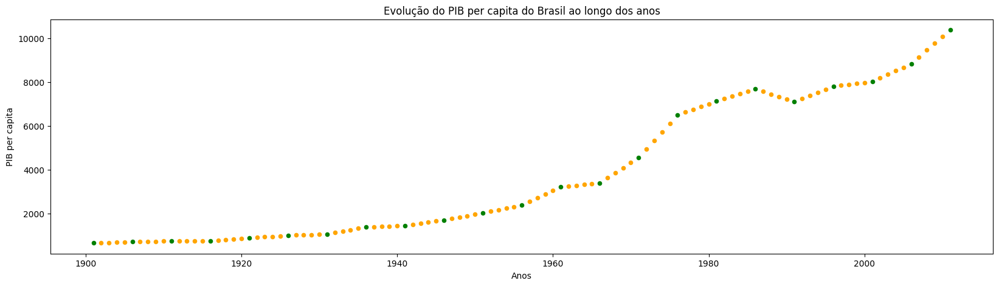

# Perguntas - GDP Per Person (1901-2011)

Projeto final do curso/módulo de Pandas. Neste projeto, você deve responder a um conjunto de perguntas feitas a dois conjuntos de dados:

1. [GDP Per Person (1901-2011)](https://www.kaggle.com/divyansh22/gdp-per-person-19012011?select=GDP.csv)

Tais conjuntos de dados são públicos foram publicados no Kaggle. Mais instruções sobre cada um deles podem ser encontrados nos links acima.

```python
mport pandas as pd
import numpy as np
import matplotlib.pyplot as plt

df_gdp = pd.read_csv("gdp.csv", decimal=".")
df_gdp = pd.DataFrame(data)
```

- Limpe o conjunto de dados, convertendo strings em datas ou float, quando necessário.

```python
df_gdp['GDP_pp'] = df_gdp[' GDP_pp '] # Criando uma nova coluna
del df_gdp[' GDP_pp ']

#Corta a string retornando uma lsita de String e pega último elemento convertendo para inteiro
df_gdp['Year'] = df_gdp['Year'].apply(lambda x:int(x.split('/')[-1])) # Retorna apenas o último elemento da lista: Ano

df_gdp['GDP'] = df_gdp['GDP_pp'].apply(lambda x: float(x.split()[0].replace(',', '')))
del df_gdp['GDP_pp']

```

- Você conseguiria informar o primeiro valor registrado de cada país?


```python
df_gdp.groupby('Country')['GDP'].min()
```


    Country
    Afghanistan     595.04
    Albania        1062.01
    Algeria        1807.76
    Andorra        3352.50
    Angola          525.76
                    ...   
    Venezuela       766.21
    Vietnam         572.96
    Yemen, Rep.     729.39
    Zambia          532.38
    Zimbabwe        385.69
    Name: GDP, Length: 193, dtype: float64

- Informe as regiões com maiores crescimentos de PIB per capita no século passado.


```python
df_gdp_start = df_gdp[df_gdp['Year'] == 1901]
df_gdp_end = df_gdp[df_gdp['Year'] == 1996]
((df_gdp_end.groupby('Region')['GDP'].mean() / df_gdp_start.groupby('Region')['GDP'].mean() -1) * 100).sort_values()
```


    Region
    Sub-Saharan Africa                               248.633780
    South America                                    312.123735
    Australia and Oceania                            396.075383
    Central America and the Caribbean                406.426789
    North America                                    589.760175
    Europe                                           594.046167
    Asia                                             711.761516
    Middle East, North Africa, and Greater Arabia    857.215950
    Name: GDP, dtype: float64

- Preecha os anos ausentes em cada país com uma estimativa, baseada na diferença entre o próximo registro e o anterior.


```python

# Gráfico do PIB per capita do Brasil ao longo dos anos
fig, ax = plt.subplots(figsize=(20, 5))
df_gdp[(df_gdp['kind'] == 'real') & (df_gdp['Country'] == 'Brazil')].plot(kind='scatter', y='GDP', x='Year', ax=ax, color='green') 
df_gdp[(df_gdp['kind'] == 'estimated') & (df_gdp['Country'] == 'Brazil')].plot(kind='scatter', y='GDP', x='Year', ax=ax, color='orange')
ax .set_xlabel('Anos')
ax.set_ylabel('PIB per capita')
ax.set_title('Evolução do PIB per capita do Brasil ao longo dos anos')
```   

```