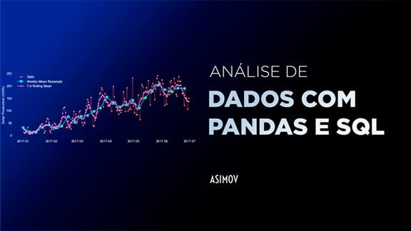

  

## 📊 Projeto realizado no Módulo de Análise de Dados com Pandas 🐼

Projeto final do módulo de Pandas. Neste projeto, foram respondidas algumas perguntas feitas a três conjuntos de dados:

### Preços da gasolina no Brasil: 

- Link para Dataset: https://www.kaggle.com/datasets/matheusfreitag/gas-prices-in-brazil

### PIB Per capital Mundial (1901-2011):
- Link para Dataset: https://www.kaggle.com/divyansh22/gdp-per-person-19012011?select=GDP.csv

### Obsidade Mundial (1975-2016):
- Link para Dataset: https://www.kaggle.com/amanarora/obesity-among-adults-by-country-19752016/

 
Tais conjuntos de dados são públicos foram publicados no Kaggle. Mais instruções sobre cada um deles podem ser encontrados nos links acima.

<table align='center'>
 <thead>
        <tr>
            <th align="center">
                 
                

                    <small>#</small>
                

            </th>
            <th align="center">
                 
                
 
                    <small>
                        PROJETOS
                    </small>
                

            </th>
        </tr>
    </thead>
    <tbody>
        <tr>
            <td>01</td>
            <td><a href="Gasolina No Brasil">Gasolina No Brasil </a></td>
        </tr>
        <tr>
            <td>02</td>
            <td><a href="Odesidade Mundial">Obesidade Mundial</a></td>
        </tr>
        <tr>
            <td>03</td>
            <td><a href="PIB Per Capita">PIB per capita</a></td>
        </tr>
    </tbody>
    </table>
    

## 🚀 Tecnologias

Esse projeto foi desenvolvido com as seguintes tecnologias:

- Pandas
- Git e Github
- Numpy
- Matplotlib
- Jumpter 